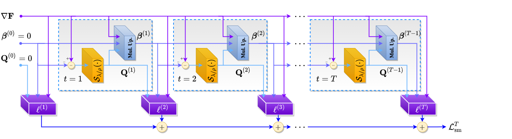

# Cost Function Unrolling in Unsupervised Optical Flow

Welcome to the official project page for the paper:  
**"Cost Function Unrolling in Unsupervised Optical Flow"**  
Published in _IEEE Transactions on Pattern Analysis and Machine Intelligence (TPAMI)_, 2023.

---

## Overview

This repository provides the official PyTorch implementation of our method for improving **unsupervised optical flow estimation** by unrolling the optimization of the cost function. Our approach introduces stronger supervision signals during training and significantly enhances final flow predictions, especially in challenging regions.

> **Note:** This repository builds on the excellent repository [ARFlow](https://github.com/lliuz/ARFlow).

---

## Getting Started

### 1. Set Up the Conda Environment

To create and activate the required environment, use:

```bash
conda env create -f environment.yaml
conda activate unrolling
```

### 2. Data Preparation

Follow the data preparation instructions provided in the [ARFlow repository](https://github.com/lliuz/ARFlow).

## Usage

### 1. Evaluating SMURF Models
KITI
```bash
python train.py -c=configs/smurf/loc/loc_raft_kitti15_unrolled.json \
                -m=checkpoints/smurf/KITTI_Flow_model_best.pth.tar -e
```
Sintel
```bash
python train.py -c=configs/smurf/loc/loc_raft_sintel_unrolled.json \
                -m=checkpoints/smurf/Sintel_model_best.pth.tar -e
```
### 2. Evaluating ARFlow Models
KIITI
```bash
python train.py -c=configs/pwc/kitti15_ft_unrolled.json \
                -m=checkpoints/pwclite/kitti15_finetuned.pth.tar -e
```
Sintel
```bash
python train.py -c=configs/pwc/sintel_ft_unrolled.json \
                -m=checkpoints/pwclite/sintel_finetuned.pth.tar -e
```

## Citation
If you find this work useful, please cite:
```
@article{lifshitz2023cost,
  title={Cost function unrolling in unsupervised optical flow},
  author={Lifshitz, Gal and Raviv, Dan},
  journal={IEEE Transactions on Pattern Analysis and Machine Intelligence},
  volume={46},
  number={2},
  pages={869--880},
  year={2023},
  publisher={IEEE}
}
```
